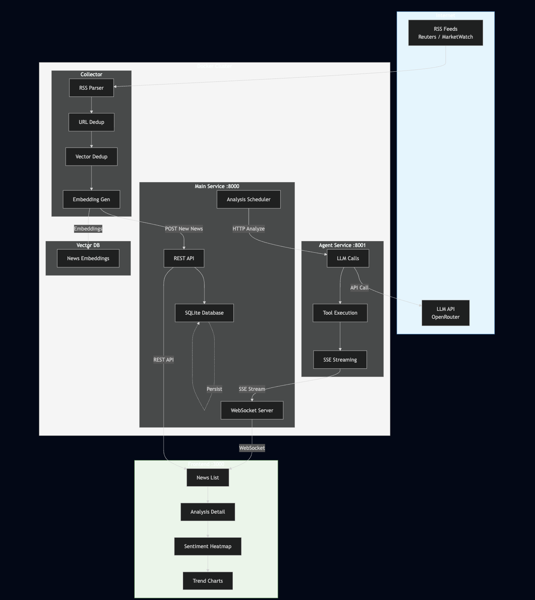

# Market News Intelligence System

[中文文档](./README_CN.md)

A full-stack application that monitors market news, evaluates its potential impact on a portfolio of financial products using AI, and presents actionable insights through a web-based dashboard.

---

## System Architecture



---

## Features

| Feature | Description |
|---------|-------------|
| **News Ingestion** | RSS feeds with two-level deduplication (URL + vector similarity) |
| **AI Analysis** | LLM-powered impact analysis with relevance scores and sentiment |
| **Real-time Updates** | WebSocket-based live dashboard updates |
| **Analytics** | Sentiment heatmap and historical trend visualization |

---

## Quick Start

### Docker Compose (Recommended)

```bash
# 1. Clone repository
git clone <repository-url>
cd news-analizer

# 2. Create environment file
cat > .env << 'EOF'
LLM_API_KEY=your_api_key_here
LLM_PROVIDER=openrouter
LLM_MODEL=minimax/minimax-m2.7
COLLECT_INTERVAL_MINUTES=1
EMBEDDING_MODEL=google/gemini-embedding-001
SIMILARITY_THRESHOLD=0.65
AGENT_TIMEOUT=120
AUTO_ANALYZE=true
LOG_LEVEL=INFO
EOF

# 3. Start all services
docker compose up -d --build

# 4. Access dashboard
open http://localhost:3000
```

### Manual Setup (Development)

```bash
# Terminal 1: Agent Service (Port 8001)
cd agent-service && npm install && npm start

# Terminal 2: Main Service (Port 8000)
cd main-service && pip install -r requirements.txt && python main.py

# Terminal 3: Frontend (Port 3000)
cd frontend && npm install && npm run dev

# Terminal 4: Collector (Background)
cd collector && pip install -r requirements.txt && python main.py --daemon --interval 1
```

---

## Environment Variables

| Variable | Required | Default | Description |
|----------|:--------:|---------|-------------|
| `LLM_API_KEY` | ✅ | - | LLM provider API key (OpenRouter recommended) |
| `LLM_PROVIDER` | | `openrouter` | LLM provider |
| `LLM_MODEL` | | - | Model identifier (e.g., `minimax/minimax-m2.7`) |
| `COLLECT_INTERVAL_MINUTES` | | `1` | News collection interval |
| `EMBEDDING_MODEL` | | `google/gemini-embedding-001` | Embedding model for deduplication |
| `SIMILARITY_THRESHOLD` | | `0.65` | Deduplication similarity threshold |
| `AGENT_TIMEOUT` | | `120` | Analysis timeout (seconds) |
| `AUTO_ANALYZE` | | `true` | Auto-analyze new articles |
| `LOG_LEVEL` | | `INFO` | Logging level |

---

## API Endpoints

### News & Products

| Method | Path | Description |
|--------|------|-------------|
| `GET` | `/api/products` | List all tracked products |
| `GET` | `/api/products/{code}` | Get product details |
| `GET` | `/api/products/{code}/impacts` | Get news affecting a specific product |
| `GET` | `/api/news` | List news (filterable) |
| `GET` | `/api/news/{id}` | Get news with analyses |

### Analysis

| Method | Path | Description |
|--------|------|-------------|
| `POST` | `/api/news/{id}/analyze` | Trigger AI analysis |
| `POST` | `/api/news/{id}/retry` | Retry failed analysis |

### Analytics

| Method | Path | Description |
|--------|------|-------------|
| `GET` | `/api/analytics/heatmap` | Sentiment heatmap data |
| `GET` | `/api/analytics/trends` | Historical sentiment trends |

### Admin

| Method | Path | Description |
|--------|------|-------------|
| `POST` | `/api/admin/cleanup-low-relevance` | Delete low-relevance analyses |
| `WS` | `/ws` | WebSocket real-time updates |

---

## Pre-configured Products

| Code | Name | Sector |
|------|------|--------|
| `7709.HK` | CSOP SK Hynix Daily (2x) Leveraged | Technology |
| `7747.HK` | CSOP Samsung Electronics Daily (2x) Leveraged | Technology |
| `7347.HK` | CSOP Samsung Electronics Daily (-2x) Inverse | Technology |
| `2828.HK` | iShares MSCI China A ETF | China A-Share |
| `83168.HK` | CSOP Hang Seng Index ETF | Hong Kong Equity |
| `3010.HK` | CSOP SSE 50 ETF | China A-Share |
| `3033.HK` | CSOP CSI 500 ETF | China A-Share |
| `3115.HK` | CSOP Nikkei 225 ETF | Japan Equity |

---

## Project Structure

```
news-analizer/
├── docker-compose.yml          # Docker orchestration
├── .env                        # Environment variables
├── main-service/               # FastAPI backend
│   ├── main.py                 # REST API + WebSocket
│   ├── database.py             # SQLite models
│   ├── schemas.py              # Pydantic schemas
│   └── data/                   # Persistent database
├── agent-service/              # Node.js LLM agent
│   ├── src/
│   │   ├── index.js            # Express server
│   │   ├── prompts.json        # Agent prompts
│   │   └── financial-contexts.json
│   └── Dockerfile
├── collector/                  # News collection
│   ├── main.py                 # RSS crawler
│   ├── processor.py            # Deduplication
│   └── sources.json            # RSS feeds
└── frontend/                   # Next.js dashboard
    └── src/app/
        ├── page.tsx            # News list
        ├── news/[id]/          # Analysis detail
        └── analytics/          # Heatmap + trends
```

---

## Design Decisions

| Decision | Rationale |
|----------|-----------|
| Two-level deduplication | URL match + vector similarity prevents duplicate analysis |
| WebSocket for real-time | Better UX for live analysis progress |
| SQLite + ChromaDB | Lightweight, embedded storage for this scale |
| SSE streaming | Efficient analysis step-by-step updates |
| Retry mechanism | Auto-retry up to 3 times for transient failures |
| Relevance threshold | Analyses with score < 3 are discarded |

---

## Tech Stack

| Category | Technology |
|----------|------------|
| Frontend | Next.js, TailwindCSS, WebSocket |
| Backend | FastAPI, SQLAlchemy, SQLite |
| Agent | Node.js, pi-agent-core |
| Deduplication | ChromaDB (vector similarity) |
| LLM | OpenRouter (configurable) |
| Deployment | Docker Compose |

---

## AI Tools Used

### Architecture Design

The system architecture was designed through an iterative multi-agent collaboration process:

1. **Multi-Agent Discussion**: Multiple AI agents analyzed the PRD and proposed different architecture designs
2. **Human Review**: I reviewed each proposal, identified unreasonable points, and made modifications
3. **AI Arbitration**: The revised design was presented to another AI for arbitration
4. **Iterative Consensus**: This process repeated until all agents and I reached agreement on the final architecture

### Development Process

| Phase | Tool | Mode | Rationale |
|-------|------|------|-----------|
| Framework Setup | OpenCode | Single Agent | Ensures consistency and prevents issues from conflicting details |
| Feature Development | OpenCode | Multi-Agent | Accelerates development after framework is stable |

### News Deduplication

- **Gemini Embedding Model**: Used for vector-based news deduplication (similarity detection)

---

## License

MIT
