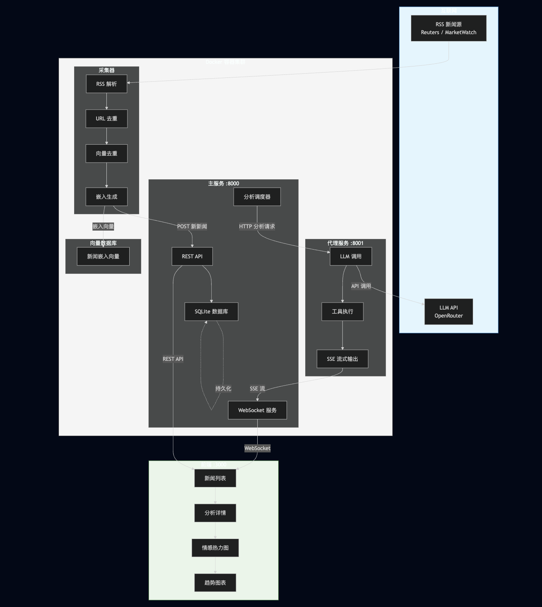

# 市场新闻智能监控系统

[English](./README.md)

一个全栈应用程序，监控市场新闻，使用 AI 评估其对金融产品组合的潜在影响，并通过 Web 仪表板展示可操作的洞察。

---

## 系统架构



---

## 功能特性

| 功能 | 描述 |
|------|------|
| **新闻采集** | RSS源采集，两级去重（URL + 向量相似度） |
| **AI 分析** | LLM驱动的影响分析，含相关性评分和情感分析 |
| **实时更新** | WebSocket 实时推送仪表板更新 |
| **数据可视化** | 情感热力图和历史趋势图表 |

---

## 快速开始

### Docker Compose（推荐）

```bash
# 1. 克隆仓库
git clone <repository-url>
cd news-analizer

# 2. 创建环境变量文件
cat > .env << 'EOF'
LLM_API_KEY=your_api_key_here
LLM_PROVIDER=openrouter
LLM_MODEL=minimax/minimax-m2.7
COLLECT_INTERVAL_MINUTES=1
EMBEDDING_MODEL=google/gemini-embedding-001
SIMILARITY_THRESHOLD=0.65
AGENT_TIMEOUT=120
AUTO_ANALYZE=true
LOG_LEVEL=INFO
EOF

# 3. 启动所有服务
docker compose up -d --build

# 4. 访问仪表板
open http://localhost:3000
```

### 手动部署（开发模式）

```bash
# 终端 1: Agent 服务 (端口 8001)
cd agent-service && npm install && npm start

# 终端 2: 主服务 (端口 8000)
cd main-service && pip install -r requirements.txt && python main.py

# 终端 3: 前端 (端口 3000)
cd frontend && npm install && npm run dev

# 终端 4: 采集器 (后台运行)
cd collector && pip install -r requirements.txt && python main.py --daemon --interval 1
```

---

## 环境变量

| 变量 | 必需 | 默认值 | 描述 |
|------|:----:|--------|------|
| `LLM_API_KEY` | ✅ | - | LLM 提供商 API Key（推荐 OpenRouter） |
| `LLM_PROVIDER` | | `openrouter` | LLM 提供商 |
| `LLM_MODEL` | | - | 模型标识（如 `minimax/minimax-m2.7`） |
| `COLLECT_INTERVAL_MINUTES` | | `1` | 新闻采集间隔（分钟） |
| `EMBEDDING_MODEL` | | `google/gemini-embedding-001` | 去重用的嵌入模型 |
| `SIMILARITY_THRESHOLD` | | `0.65` | 去重相似度阈值 |
| `AGENT_TIMEOUT` | | `120` | 分析超时时间（秒） |
| `AUTO_ANALYZE` | | `true` | 自动分析新文章 |
| `LOG_LEVEL` | | `INFO` | 日志级别 |

---

## API 端点

### 新闻与产品

| 方法 | 路径 | 描述 |
|------|------|------|
| `GET` | `/api/products` | 获取所有跟踪产品 |
| `GET` | `/api/products/{code}` | 获取产品详情 |
| `GET` | `/api/products/{code}/impacts` | 获取影响指定产品的新闻 |
| `GET` | `/api/news` | 获取新闻列表（可筛选） |
| `GET` | `/api/news/{id}` | 获取新闻及分析结果 |

### 分析

| 方法 | 路径 | 描述 |
|------|------|------|
| `POST` | `/api/news/{id}/analyze` | 触发 AI 分析 |
| `POST` | `/api/news/{id}/retry` | 重试失败的分析 |

### 数据分析

| 方法 | 路径 | 描述 |
|------|------|------|
| `GET` | `/api/analytics/heatmap` | 情感热力图数据 |
| `GET` | `/api/analytics/trends` | 历史情感趋势 |

### 管理

| 方法 | 路径 | 描述 |
|------|------|------|
| `POST` | `/api/admin/cleanup-low-relevance` | 删除低相关度分析 |
| `WS` | `/ws` | WebSocket 实时更新 |

---

## 预配置产品

| 代码 | 名称 | 板块 |
|------|------|------|
| `7709.HK` | CSOP SK Hynix Daily (2x) Leveraged | Technology |
| `7747.HK` | CSOP Samsung Electronics Daily (2x) Leveraged | Technology |
| `7347.HK` | CSOP Samsung Electronics Daily (-2x) Inverse | Technology |
| `2828.HK` | iShares MSCI China A ETF | China A-Share |
| `83168.HK` | CSOP Hang Seng Index ETF | Hong Kong Equity |
| `3010.HK` | CSOP SSE 50 ETF | China A-Share |
| `3033.HK` | CSOP CSI 500 ETF | China A-Share |
| `3115.HK` | CSOP Nikkei 225 ETF | Japan Equity |

---

## 项目结构

```
news-analizer/
├── docker-compose.yml          # Docker 编排
├── .env                        # 环境变量
├── main-service/               # FastAPI 后端
│   ├── main.py                 # REST API + WebSocket
│   ├── database.py             # SQLite 模型
│   ├── schemas.py              # Pydantic 模式
│   └── data/                   # 持久化数据库
├── agent-service/              # Node.js LLM 代理
│   ├── src/
│   │   ├── index.js            # Express 服务器
│   │   ├── prompts.json        # Agent 提示词
│   │   └── financial-contexts.json
│   └── Dockerfile
├── collector/                  # 新闻采集
│   ├── main.py                 # RSS 爬虫
│   ├── processor.py            # 去重处理
│   └── sources.json            # RSS 源配置
└── frontend/                   # Next.js 仪表板
    └── src/app/
        ├── page.tsx            # 新闻列表
        ├── news/[id]/          # 分析详情
        └── analytics/          # 热力图 + 趋势
```

---

## 设计决策

| 决策 | 原因 |
|------|------|
| 两级去重 | URL 匹配 + 向量相似度防止重复分析 |
| WebSocket 实时更新 | 更好的分析进度用户体验 |
| SQLite + ChromaDB | 轻量级嵌入式存储，适合当前规模 |
| SSE 流式传输 | 高效的分步分析更新 |
| 重试机制 | 自动重试最多 3 次处理临时故障 |
| 相关度阈值 | 评分 < 3 的分析将被丢弃 |

---

## 技术栈

| 类别 | 技术 |
|------|------|
| 前端 | Next.js, TailwindCSS, WebSocket |
| 后端 | FastAPI, SQLAlchemy, SQLite |
| 代理服务 | Node.js, pi-agent-core |
| 去重 | ChromaDB（向量相似度） |
| LLM | OpenRouter（可配置） |
| 部署 | Docker Compose |

---

## AI 工具使用

### 架构设计

系统架构通过迭代式多智能体协作过程设计：

1. **多智能体讨论**：多个 AI 智能体分析 PRD 并提出不同的架构设计方案
2. **人工审核**：我审核每个提案，识别不合理之处并进行修改
3. **AI 仲裁**：将修改后的设计提交给另一个 AI 进行仲裁
4. **迭代共识**：重复此过程直到所有智能体和我达成一致

### 开发过程

| 阶段 | 工具 | 模式 | 原因 |
|------|------|------|------|
| 框架搭建 | OpenCode | 单智能体 | 确保一致性，避免细节冲突导致系统无法运行 |
| 功能开发 | OpenCode | 多智能体 | 框架稳定后加速开发进度 |

### 新闻去重

- **Gemini 嵌入模型**：用于基于向量的新闻去重（相似度检测）

---

## 开发时间

~18 小时

---

## 许可证

MIT